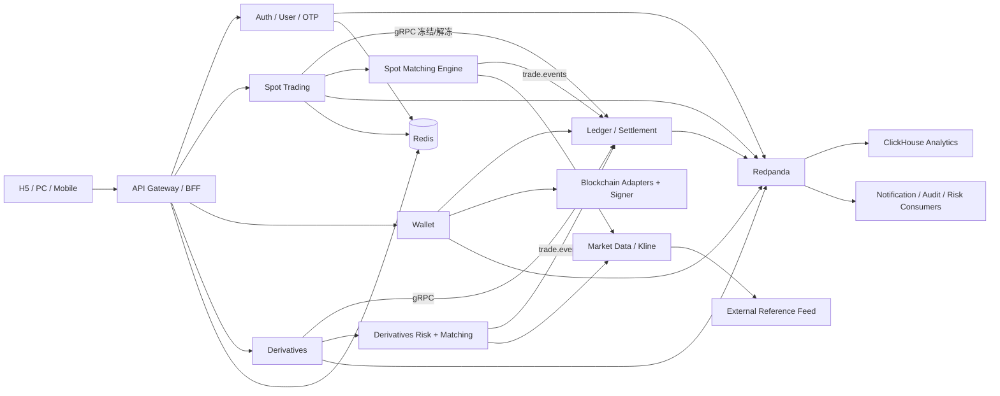

# 虚拟资产交易所需求文档

版本：v0.2 Draft（2026-09-27，基于 v0.1 评审补充）  
后端：Go 1.26+  
架构：微服务（单仓库、单 Go module）  
消息系统：Kafka 兼容协议，首选 Redpanda  
主数据库：PostgreSQL 16；缓存/限流：Redis 7.4  
分析数据库：ClickHouse 25.3  
客户端：响应式 H5（第一优先级）→ PC 桌面端（Tauri）→ Android/iOS

> 术语约定：本文中"必须"表示第一版上线前的硬性要求；"应"表示默认要求，偏离需记录 ADR；"可"表示可选。  
> 27 项结构性决策已于 2026-09-28 由用户逐项确认，结论见 [文档评审与待决策-2026-09-27.md](文档评审与待决策-2026-09-27.md) §8；原先标为"待确认"的默认值全部采纳为**可配置默认值**，本版已去掉标记。

## 0. 变更记录（v0.1 → v0.2）

| 类型 | 内容 |
|---|---|
| 修正 | 客户端范围与实施计划对齐：第一版以响应式 H5 为主，PC 端复用，移动端放到第四阶段（v0.1 §2.1 把四端都列为第一版必须） |
| 修正 | 明确第一版**无密码**，仅验证码登录，并补充由此带来的找回/换绑/SIM 换卡风险与对策 |
| 修正 | Binance 行情使用从"必须核对条款"升级为**阻断性法律风险**（条款明文禁止商业交易服务使用其数据），给出替代方案 |
| 修正 | 事件主题补齐 `instrument.events`、`account.events`；与测试环境已建 topic 对齐 |
| 修正 | Redis 在 v0.1 中完全没有出现，本版定义其职责边界 |
| 新增 | §7.1 API 通用约定：金额字符串化、时间格式、分页、错误响应结构、幂等键语义、ID 策略 |
| 新增 | §7.3 WebSocket 协议：鉴权、订阅、心跳、深度快照+增量、序号与断线恢复 |
| 新增 | §11 核心流程与规则：下单到结算时序、订单规则（TIF/STP/价格保护）、手续费、账本科目与分录、充值/提现状态机、合约公式、K 线规则、指数价源 |
| 新增 | §5.13 风控/反滥用服务、§5.14 功能开关；§6.3 人机验证与短信轰炸防护；§6.4 账号找回与换绑 |
| 新增 | §12 非功能要求补充量化指标（限流、性能、RPO/RTO 建议值）、PII 分级与日志脱敏、数据保留 |
| 新增 | 附录：术语表、状态机枚举、错误码分段、技术选型建议 |
| 新增 | 账户模型：现货账户 / 合约账户及两者之间的划转（v0.1 缺失） |
| 新增（并行评审清单核对后） | §2 定义"第一版 = 阶段 1–3 累计"与 MVP；§5.4 账户状态影响矩阵；§5.9 对账频率与差异处置；§5.10 地址校验、站内地址、ERC-20 归集 gas、链上费估算；§5.12 三级紧急开关；§6.6 Token 存放/CORS/设备上限；§7.3 WS 多实例扇出；§11.5 错误网络充值策略；§11.6 无 KYC 限额、新设备限制、等值来源；§11.7 保险基金来源；§11.8 24h ticker 定义与展示策略；**§11.10 流动性与做市** |
| 修正（并行会话复核 v0.2，2026-09-28） | §11.4 不变量按资产求和、新增符号约定与 `UNCLAIMED_DEPOSIT`、热/冷钱包移出账本科目、`ADJUSTMENT` 可为负；§11.1 PlaceOrder 命令改经 outbox 发布并补崩溃恢复、限价买单价差在成交时解冻；§11.6 审批阈值改为相对日限额、撤销时点统一为进入 SIGNING 前、提现 step-up 与 `WITHDRAW_CONFIRM` 合并为一次验证；§11.7 补破产价公式与手续费说明、降级触发改为可用价源 < 2；§10.3 资金费舍入改为付方向上取整、收方向下取整；§6.6 Tauri 不同站不能用 cookie；§11.10 做市参考价须来自授权源；§12.3 t2 突发型实例不作压测基准；§12.5 账本归档需余额锚点；§3 lightweight-charts 归属要求；§5.10 xpub 派生与 gas 科目；错误码名统一（`COMMON_IDEMPOTENCY_CONFLICT`、`COMMON_RATE_LIMITED`、`AUTH_TOKEN_EXPIRED`）；§8.1 OrderAccepted/Rejected 产出方 |
| 决策落实（2026-09-28） | 27 项决策全部确认并写回：登录改为密码 + 验证码 + 地理位置挑战（§2.1/§5.2/§6）；合约支持双向持仓（§2.1/§5.8/§7.2/§11.7/附录 B）；提现到站内地址转为内部划转（§2.2/§5.10/§11.4/§11.6/附录 B）；项目定位为学习项目（§1）；Sepolia、module path 与技术选型确认（§2.1/§10）；所有"待确认"默认值采纳为可配置默认值并去掉标记 |
| 修正（2026-09-28 晚） | 二次验证触发条件改为"最近 7 天无成功登录"，取消 IP 地理位置判定（§2.1/§5.2/§6.1/§13/附录 C）；测试域名 astras.vip 经 Cloudflare 代理，TLS 用源站证书 + nginx（§6.6）；Turnstile 服务端校验已实现（§6.3）；可观测性改为 OTLP 直发 Grafana Cloud（§12.2） |
| 补充（2026-09-28，实施 §10 任务 3） | §7.1 追踪约定细化为 `X-Trace-Id` 响应头 + 错误体 `trace_id`，接受 W3C `traceparent`；附录 C 补充通用错误码与 HTTP 状态分类 |
| 补充（2026-09-28，实施 §10 任务 5） | §8 Envelope 增加 `traceparent`，记录实现方式与 Schema Registry 线上格式；§8.1 新增 `notification.events`（站内信推送），重试/死信记录的头字段 |

## 1. 文档目标

本文定义第一版虚拟资产交易所的产品范围、服务边界、核心流程、数据模型、事件模型和非功能要求，供产品、后端、客户端、DevOps、安全和测试团队共同使用。

本版本暂不实现 KYC 流程，但需要保留合规服务接口、地区限制、额度限制和审计扩展点。正式上线真实资产充值提现、杠杆或衍生品前，必须单独完成目标地区的法律和牌照评估，并解决 §11.9 的行情数据授权问题。

项目定位（2026-09-28 用户确认）：本项目主要用于学习，不一定上线。开发时假定已在各国取得牌照，不限制地区，地区允许列表默认全开；本文所有合规、牌照、数据授权条目保留为"上线前必须完成"的检查项，不阻塞设计与开发。

## 2. 产品范围

本文的"第一版"指实施计划**阶段 1–3 累计交付**的范围；其中阶段 1 交付的可用子集称为 MVP（注册登录、资产配置、模拟账本、H5 基础页）。下文"第一版必须支持"的条目在实施计划中分散于阶段 1–3，阶段归属以实施计划为准。

### 2.1 第一版必须支持

- 邮箱注册、手机号注册：注册时**设置密码**并通过一次性验证码（OTP）验证身份。日常登录**默认使用密码**，保留验证码登录入口；当账户**最近 7 天内没有成功登录**时，密码校验通过后还需验证码二次验证；7 天内登录过则仅密码即可，不判断 IP 地理位置。TOTP 作为可选二次验证在阶段 2 提现上线前接入。
- 邮箱验证码通过邮件服务商发送；手机验证码通过第三方短信 API 发送。发送前必须通过人机验证（§6.3）。
- 验证码登录、刷新 Token、退出登录、设备会话管理、登录历史。
- 账户模型：每个用户拥有现货账户和 USDT 合约账户，两者账本逻辑隔离，支持现货 ↔ 合约账户划转。
- 现货交易：限价单、市价单、撤单、部分成交、成交历史；TIF 支持 `GTC`、`IOC`、`FOK`、`POST_ONLY`。
- 合约交易：USDT 保证金永续合约；交割合约的数据模型和接口预留。
- 合约杠杆、逐仓/全仓、单向/双向持仓模式（按合约切换）、开仓、平仓、只减仓、止盈止损、资金费率、标记价、强平、保险基金和 ADL。
- 虚拟资产充值、提现、地址生成、区块确认和链上交易状态跟踪。第一版仅接入 Sepolia 测试网：ETH + 自部署测试 ERC-20（充当 USDT）。
- 交易对、资产精度、最小下单额、手续费和状态管理。
- 流动性保障：平台做市机器人以系统账户在参考价附近双边报价，保证新交易对订单簿非空（§11.10）。
- 平台自身成交 K 线；外部参考行情源（默认开发期用 Binance 公共数据，上线前必须替换或取得授权，见 §11.9）。
- WebSocket 实时推送行情、订单、成交、资产、仓位和风险告警。
- Kafka/Redpanda 事件总线和 ClickHouse 分析库从第一版接入。
- 管理后台：用户、交易对、订单、提现审批、风控告警、费率、功能开关和审计日志。
- 用户通知：新设备登录、提现申请/完成、充值到账、强平预警、账户状态变化，通过邮件/短信/站内信发送。

### 2.2 第一版不包含

- KYC、证件识别、人工身份审核。
- 法币充值和提现。
- 期权、借贷、理财、跟单和复制交易、现货杠杆、网格/策略交易。
- 代币发行、Launchpad 和平台币。
- 交割合约的真实交割流程；保留领域模型和功能开关。
- 用户 API Key（程序化交易）、子账户、用户主动发起的用户间转账（提现到站内地址的自动内部划转除外，见 §11.6）、邀请返佣。
- 现货止盈止损/条件单（合约支持止盈止损，现货第一版不支持）。
- 原生 Android/iOS 客户端（阶段 4）。

没有 KYC 不代表可以忽略反滥用和地区限制。第一版必须支持 IP、设备、登录行为、提现行为、额度和账户状态风控，以及按国家/地区码的注册与功能限制。

## 3. 客户端要求

所有客户端共用同一套 OpenAPI、WebSocket 协议、错误码、权限声明和设备会话接口；移动端接入不得改变已发布的协议语义。

- **响应式 H5（第一优先级）**：React 19 + TypeScript + Vite；状态与数据层建议 TanStack Query + Zustand；图表建议 TradingView `lightweight-charts`（Apache-2.0，但其许可要求界面保留 TradingView 归属标识与链接；完整 Charting Library 需另行签约）；i18n 建议 react-i18next，首发中文/英文；以 PWA 形式支持"添加到主屏幕"。
- **PC 桌面端（第二优先级）**：Tauri 2 封装 H5 前端，复用页面组件与全部协议；仅在需要系统级能力（托盘、通知、自动更新、安全存储）时增加 Tauri 插件。
- **Android/iOS（阶段 4）**：Flutter 或 React Native，复用已冻结协议，补充安全存储、推送和系统权限。
- **管理后台前端**：独立 Web 应用（React + TS），独立域名与部署，仅允许办公网/VPN 访问，管理员登录必须 TOTP。
- 客户端不保存私钥，不直接调用区块链节点签名，不直接请求外部行情源。
- 敏感操作（提现、换绑身份、关闭设备会话、修改安全设置）需要 step-up 重新验证（§6.5）。
- 客户端展示的所有金额、价格、数量均以字符串形式接收，按资产/交易对精度格式化，不做浮点运算。

## 4. 总体架构



核心原则：

1. 账本是资产余额的唯一事实来源；任何余额变化都来自不可变的双重记账分录。
2. Redpanda/Kafka 负责可靠传递事件；ClickHouse 只用于分析和历史查询，不能修改余额或驱动撮合。
3. **同步调用只用于必须立刻拿到结果的路径**（下单前冻结、划转、提现前扣冻），走 gRPC + Protobuf；其余全部事件驱动。
4. Redis 只承担可丢失的数据：限流计数、OTP 发送频控、幂等键短期缓存、WebSocket 会话路由、行情快照缓存。**Redis 中不存放任何余额、订单或会话的唯一副本**；Redis 清空后系统必须能完全自愈。
5. 撮合引擎、签名服务、账本服务三者互相不共享进程与数据库。

## 5. 微服务边界

### 5.1 API Gateway / BFF

- 统一鉴权（校验 access token、注入 `user_id`）、限流、幂等键、版本管理和 trace ID。
- 对外提供 REST 和 WebSocket；WebSocket 连接管理与私有频道鉴权在此层完成。
- 不承载核心交易状态，不直接访问其他服务的数据库。
- 出错时统一错误结构（§7.1），屏蔽内部服务名和堆栈。

### 5.2 Auth Service

- 注册、验证码登录、Token、刷新、退出、设备会话、登录历史。
- 邮箱和手机号均为独立身份（identity），可绑定到同一用户；每个用户至少保留一个已验证身份。
- 邮箱统一 trim 后转小写；手机号统一为 E.164 格式；注册时校验国家/地区码是否在允许列表。
- 统一防止账号枚举：注册和发送验证码接口不得泄露账号是否存在（同一场景返回相同结构与耗时特征）。
- 密码：Argon2id 哈希（内存 64 MiB、迭代 3、并行 1）；长度 10–128，不做字符组合规则，拒绝常见弱密码与泄露密码字典；连续 10 次失败锁定 15 分钟并通知用户；密码登录失败 3 次后要求人机验证。
- 登录沉默期挑战：密码校验通过后，若该账户最近一次成功登录距今超过 7 天（可配置），返回 `AUTH_LOGIN_CHALLENGE_REQUIRED` 并要求向绑定身份发送验证码完成二次验证；7 天内有成功登录则直接签发 token。不做 IP 地理位置判断；新设备登录通知照发。
- access token：JWT，EdDSA（Ed25519）签名，有效期 15 分钟，包含 `sub`、`sid`（会话 ID）、`iat`、`exp`、`scope`；密钥支持轮换（`kid`）。
- refresh token：不透明随机串，服务端仅存哈希，有效期 30 天，**每次刷新轮换**；检测到旧 refresh token 被重放时立刻吊销整个会话族并通知用户。
- 设备会话记录：设备指纹、UA、IP、地理位置（粗粒度）、首次/最近活跃时间、是否当前设备；支持单个撤销与"退出全部其他设备"。

### 5.3 OTP Service / Notification Service

- OTP Service 生成、校验、失效和限流；Notification Service 通过 Adapter 调用邮件和短信供应商，并负责用户通知模板与站内信。
- 邮件和短信供应商必须可配置切换，不允许业务代码直接依赖供应商 SDK；至少配置一主一备。
- 验证码要求：6 位数字、有效期 5 分钟、单次消费、最多尝试 5 次、重新发送间隔 60 秒；同一目标地址 每小时 5 次 / 每日 10 次，同一 IP 每小时 20 次，同一设备 每小时 10 次。
- 数据库只保存验证码哈希（HMAC-SHA256 + 服务端密钥，或 bcrypt），验证码不得写入普通日志、事件 payload 或 ClickHouse。
- 发送结果（供应商回执、失败原因分类）落库并发事件，供后台查看供应商健康度。

### 5.4 User Service

- 用户主档、账户状态、绑定身份、语言、时区、通知偏好、反钓鱼码。
- 账户状态：`ACTIVE`、`RISK_REVIEW`、`FROZEN`、`CLOSED`。状态变更必须带原因码、操作者与审计事件。影响矩阵：

| 状态 | 登录 | 查看 | 充值入账 | 现货下单 | 合约开仓 | 平仓/撤单 | 划转 | 提现 |
|---|---|---|---|---|---|---|---|---|
| `ACTIVE` | ✓ | ✓ | ✓ | ✓ | ✓ | ✓ | ✓ | ✓ |
| `RISK_REVIEW` | ✓ | ✓ | ✓ | ✓ | ✗ | ✓ | ✗ | ✗ |
| `FROZEN` | ✓（只读） | ✓ | ✓（入账但不可动） | ✗ | ✗ | 仅系统强平 | ✗ | ✗ |
| `CLOSED` | ✗ | ✗ | 记入 `UNCLAIMED_DEPOSIT` | ✗ | ✗ | ✗ | ✗ | ✗ |

  `FROZEN` 用户的挂单由系统批量撤销并解冻；`CLOSED` 前必须满足 §5.4 关闭条件。
- `eligibility` 接口：输入用户 + 功能（`SPOT_TRADE`、`DERIVATIVES_TRADE`、`DEPOSIT`、`WITHDRAW`、`TRANSFER`），输出允许/拒绝与原因码；第一版依据账户状态、地区码、功能开关判断，预留 KYC 等级入口。
- 账户关闭流程：需无未完成订单、无持仓、无在途提现、余额低于阈值，进入 30 天冷静期后匿名化 PII。

### 5.5 Market / Instrument Service

- 管理资产、网络、交易对、合约、精度、最小名义金额、手续费和状态。
- 资产字段：`asset_code`、显示名、`decimals`、是否可充/可提/可交易、风险开关。
- 网络字段（资产 × 链）：链标识、合约地址、充值确认数、最小充值额、最小提现额、提现固定手续费、是否需要 Memo/Tag、状态。
- 交易对字段：`symbol`、base/quote、价格精度（tick size）、数量精度（lot size）、最小/最大下单数量、最小名义金额、价格保护带宽、maker/taker 费率等级、状态。
- 交易对状态：`PREPARE`、`TRADING`、`HALT`、`CANCEL_ONLY`（仅允许撤单，用于下线前和异常处置）、`DELISTED`。
- 合约字段：面值/合约乘数、保证金资产、杠杆上限、风险限额阶梯（名义金额 → 维持保证金率、最大杠杆）、资金费率周期与上限、标记价参数、到期时间（交割）。
- 所有配置变更版本化，带生效时间，发布 `instrument.events`。

### 5.6 Spot Trading Service

- 接收下单、撤单、批量撤单、订单查询和成交查询。
- 支持 `LIMIT`、`MARKET`；TIF `GTC`、`IOC`、`FOK`、`POST_ONLY`；订单状态见附录 B。
- 下单前校验：交易对状态、精度、最小/最大数量、最小名义金额、价格保护带、用户 eligibility、每用户每交易对最大挂单数 200、幂等键。
- 通过 gRPC 同步调用 Ledger 冻结（买单冻结 quote，卖单冻结 base；市价买单按 quote 金额冻结）；冻结失败直接拒单，不进入撮合。
- 自成交保护 STP，默认 `CANCEL_NEWEST`（新单被拒），可按交易对配置 `CANCEL_OLDEST`/`CANCEL_BOTH`。

### 5.7 Spot Matching Engine

- Go 独立进程，按交易对分片，一个分片同一时刻只有一个 active 实例（主备，基于租约）。
- 内存订单簿 + WAL + 定期快照，订单簿可确定性重放：相同输入序列必须产出完全相同的输出序列。
- 引擎内部时间只用递增 `sequence`，不依赖墙上时钟做排序。
- 产生带递增 sequence 的订单事件与成交事件，写入 `order.events`/`trade.events`，分区键为 `symbol`。
- 撮合层不持有余额，也不做余额校验；由 Ledger/Settlement 消费成交事件完成结算。
- 输入命令通过持久化队列（Redpanda `order.commands`，分区键 `symbol`）进入引擎，保证重放输入可得；引擎对每条命令写 WAL 后再处理。

### 5.8 Derivatives Service

第一版支持 USDT 永续合约，支持单向与双向（对冲）持仓模式，用户可在无持仓且无挂单时按合约切换；交割合约先实现模型和配置接口。

- 开仓、平仓、只减仓、限价、市价、止盈止损（触发价基于标记价或最新价，可选）接口。
- 逐仓和全仓保证金；逐仓支持追加/减少保证金；有持仓时调整杠杆需重新校验保证金。
- 杠杆档位、初始保证金、维持保证金、未实现盈亏和已实现盈亏，公式见 §11.7。
- 多源指数价、标记价、资金费率、预估强平价。
- 强平队列、保险基金、自动减仓 ADL、穿仓保护。
- 当指数价、行情源或风控服务不可用时，进入限制开仓或只减仓模式，并发 `risk.events` 告警。
- 合约撮合复用现货撮合引擎代码，作为独立分片部署。

### 5.9 Ledger / Settlement Service

- 不可变双重记账；科目、分录类型与不变量见 §11.4。
- 交易前冻结余额，成交后扣减和入账，撤单后解冻；充值确认、提现扣款、手续费、资金费率、强平、保险基金、账户划转均形成账本分录。
- 对外提供 gRPC：`Freeze`、`Unfreeze`、`Transfer`、`GetBalances`，均要求幂等键。
- 账本写入必须幂等：以 `(source_event_id)` 或业务幂等键唯一约束保证重复消费不产生重复分录。
- 对账：每小时增量核对（分录合计 = 0、每账户余额 = 分录累加、订单冻结合计 = 账本冻结合计），每日全量核对（用户负债合计 vs 链上热+温+冷钱包资产、撮合成交合计 vs 账本成交分录、ClickHouse 条数 vs PostgreSQL）。
- 差异处置：账本内部不变量任何非零差异为 P1 事故，自动暂停该资产提现并告警；钱包资产 < 用户负债时自动暂停该资产提现；差异报告持久化，处置需双人审批的 `MANUAL_ADJUSTMENT` 分录，禁止直接改数。

### 5.10 Wallet / Blockchain Service

- 链适配器、地址生成（HD 派生，每用户每网络一个地址；业务侧只持有扩展公钥 xpub 做地址派生，私钥派生与签名只在签名服务）、区块扫描、确认数、链重组、Memo/Tag 和交易广播。
- 热钱包、温钱包、冷钱包分层；签名服务独立部署，业务服务只能通过白名单接口请求签名，签名服务校验目的地址、金额与审批单。
- 归集（sweep）：用户地址余额达到阈值后归集到热钱包；第一版允许人工触发。热钱包余额高于上限自动告警并人工转冷。
- 提现支持地址白名单（新增白名单后 24 小时冷却）、单笔/单日限额、风险评分、超阈值双人审批；提现手续费按网络配置。
- 提现请求先冻结余额，广播成功后扣减，拒绝/失败后解冻；状态机见 §11.6。
- 每笔充值和提现都有状态机及链上 TxHash；EVM 提现需管理 nonce 与 gas 估算，支持加速与替换。
- 钱包服务通过 Adapter 支持后续新增 BTC、EVM、TRON、Solana 等链。
- 提现地址按链做格式与校验和校验（EVM EIP-55、TRON Base58Check 等）；需要 Memo/Tag 的网络缺 Memo 时拒绝（`WALLET_MEMO_REQUIRED`）；检测到站内地址时转为内部划转（§11.6）。
- ERC-20 归集需要用户地址持有 ETH 作 gas：由 gas 补给账户（系统账户）先向用户地址转入所需 gas 再归集，或使用 EIP-2771/合约钱包批量归集（第一版用 gas 补给方式）；gas 消耗从 `GAS_SUPPLY` 科目扣减（对手科目 `WITHDRAWAL_PENDING`，因为它是真实的链上流出）并计为平台费用。
- 链上手续费估算：提现前按网络实时估算，估算值高于配置上限时提现停留在 `APPROVED` 并告警。

### 5.11 Market Data / Kline Service

- 服务端抓取外部参考行情（REST + WebSocket），完成缓存、限频、断线重连、历史补齐和去重。
- 根据平台自身成交事件生成平台 K 线，规则见 §11.8。
- 对外提供 ticker、depth、trades、candles 和 WebSocket 推送；深度以快照 + 增量方式发布（§7.3）。
- 外部数据只作为参考或指数来源；合约标记价和清算价使用可审计的多源数据。
- 外部行情源授权见 §11.9（阻断性）。

### 5.12 Admin / Audit / Reporting Service

- RBAC 权限、双人审批、操作审计、提现审批、交易对管理、费率管理、功能开关和用户处置（冻结、强制撤单、状态调整）。
- 手动账务调整（补账、冲正）必须走双人审批并产生账本分录，禁止直接改余额。
- 所有管理员操作记录操作者、时间、目标对象、变更前后值和 trace ID；审计日志追加写入，禁止更新与删除。
- 紧急开关分三级：全站（一键 `CANCEL_ONLY`、暂停提现、暂停开仓）、单交易对（`HALT`/`CANCEL_ONLY`）、单资产（暂停充值/提现/交易）。全部为功能开关，变更即审计。

### 5.13 Risk / Anti-abuse Service（新增）

- 规则引擎：IP 信誉、设备指纹、注册频率、登录异常（新设备/新地区）、提现行为（首次提现、地址新增后短期提现、金额突增）。
- 输出风险分与动作：放行、要求 step-up 验证、进入人工审核、拒绝、置为 `RISK_REVIEW`。
- 消费 `auth.events`、`wallet.withdrawal.events`、`order.events`，发布 `risk.events`。
- 第一版规则可用配置表达，不要求机器学习。

### 5.14 Feature Flag / 配置开关（新增）

- 所有高风险能力（合约、提现、真实广播、新资产、新交易对、外部行情源）都由开关控制，开关维度：全局、地区、账户状态、资产、交易对、用户白名单。
- 开关存储在 PostgreSQL，服务本地缓存 5 秒并订阅变更事件；变更需 RBAC 并写审计。
- 开关默认值为关闭；缺失配置时按关闭处理。

## 6. 注册、登录与验证码流程

### 6.1 接口

```text
POST /v1/auth/otp/request          # 发送验证码（需携带人机验证凭据）
POST /v1/auth/otp/verify           # 校验验证码，返回 otp_ticket
POST /v1/auth/register/complete    # 用 otp_ticket 完成注册（设置密码、接受条款、设置语言）
POST /v1/auth/login/complete       # 用 otp_ticket 完成验证码登录（备用方式），返回 token 对
POST /v1/auth/login/password       # 密码登录（默认方式）；超过 7 天未登录时返回 login_challenge_id
POST /v1/auth/login/challenge      # 超过 7 天未登录后的验证码二次验证
POST /v1/auth/password/reset/request   # 忘记密码：向绑定身份发验证码
POST /v1/auth/password/reset/complete
POST /v1/auth/password/change      # 修改密码（需 step-up）
POST /v1/auth/token/refresh
POST /v1/auth/logout               # 当前会话
POST /v1/auth/logout/all           # 其他全部会话
POST /v1/auth/identity/bind        # 绑定第二身份（需 step-up）
POST /v1/auth/identity/rebind      # 换绑身份（§6.4）
GET  /v1/auth/sessions             # 设备会话列表
DELETE /v1/auth/sessions/{session_id}
GET  /v1/auth/login-history
POST /v1/auth/step-up              # 敏感操作前重新验证，返回 step_up_token
```

`otp/request` 参数：`scene`、`channel`、`identifier`、`captcha_token`、`device_id`。  
`channel` 为 `EMAIL` 或 `SMS`；`scene` 为 `REGISTER`、`LOGIN`、`BIND_IDENTITY`、`REBIND_IDENTITY`、`WITHDRAW_CONFIRM`、`STEP_UP`、`PASSWORD_RESET`、`LOGIN_CHALLENGE`。

成功请求返回 `challenge_id`、过期时间和发送状态（`QUEUED`/`SENT`/`FAILED_RETRYING`）。`REGISTER` 与 `LOGIN` 场景对"账号是否存在"返回完全相同的结构；若身份不存在而请求 `LOGIN`，仍返回 `challenge_id`，校验阶段再以统一错误码 `AUTH_OTP_INVALID` 拒绝。

验证成功后 `otp/verify` 返回一次性 `otp_ticket`（有效期 5 分钟，绑定 `challenge_id`、`scene`、`device_id`），后续 `*/complete` 接口凭 ticket 完成动作，避免验证码在多个接口间重复传递。

### 6.2 失败和供应商故障

- 第三方邮件或短信超时后重试，使用指数退避（1s、4s、16s，最多 3 次），超过后切换备用供应商。
- 多次失败进入死信队列，管理员后台可查看供应商状态与失败分类（超时、拒绝、号码无效、余额不足）。
- 供应商熔断时返回统一错误码 `NOTIFY_PROVIDER_UNAVAILABLE`，不暴露内部供应商名称和密钥信息。
- 验证码发送、验证、失败和锁定均写入审计事件（payload 仅含掩码后的目标地址）。

### 6.3 人机验证与短信轰炸防护（新增）

短信按条计费，OTP 请求接口是最常见的被刷目标（SMS pumping / toll fraud）。要求：

- `otp/request` 必须携带人机验证凭据（Cloudflare Turnstile；服务端校验已在 `internal/platform/captcha` 实现，见 docs/runbook/turnstile.md），校验通过后才允许发送。
- 短信目标国家/地区码维护允许列表与高风险列表；高风险地区码默认只允许邮箱注册。
- 同一 IP/设备/目标号码分钟级与日级配额（§5.3），超限返回 `COMMON_RATE_LIMITED` 且不发送。
- 短信日总量与小时总量设置熔断阈值，触发后自动暂停短信发送并告警。
- 短信内容不包含可点击链接，仅验证码与平台名。

### 6.4 账号找回与身份换绑（新增）

登录模型：注册时设置密码并通过绑定身份的验证码完成验证；日常登录使用密码，验证码登录作为备用入口保留。密码与身份任一丢失都可通过另一个因子找回，因此：

- 引导用户绑定第二身份（邮箱 + 手机）；仅有一个身份的用户提现限额降低（建议为正常限额的 20%）。
- 换绑：拥有双身份者，用另一身份 OTP + step-up 后换绑；仅有单身份者的换绑进入人工审核队列，管理员双人审批，并冷却 72 小时期间禁止提现。
- 换绑、绑定、撤销会话均向旧身份发送通知。
- SIM 换卡与邮箱接管风险：密码是第二道门，但手机号单身份账户的提现仍必须叠加邮箱 OTP 或 TOTP；TOTP 在阶段 2 提现开放前必须可用。
- 忘记密码：向任一已绑定身份发送 `PASSWORD_RESET` 验证码，验证后设置新密码并吊销全部会话；重置后 24 小时内提现强制人工审批。

### 6.5 Step-up 重新验证

- 提现、换绑、新增白名单地址、关闭其他设备、修改安全设置必须携带 `step_up_token`（有效期 10 分钟，单次使用或限定动作）。
- step-up 方式优先级：TOTP（已绑定时）> 未用于本次登录的另一身份 OTP > 本次登录身份 OTP。

### 6.6 Token 存放、CORS 与设备上限（新增）

- H5：access token 只放内存（不写 localStorage）；refresh token 放 `HttpOnly; Secure; SameSite=Strict` cookie，`Path` 限定为 `/v1/auth/token/refresh`；刷新接口校验 `Origin` 头，配合 SameSite 防 CSRF；页面刷新后静默调用 refresh 重建内存 token。备选：全部走 bearer + localStorage（实现简单但 XSS 风险更高）。
- CORS：精确 origin 允许列表，禁止通配；仅刷新与登出接口允许携带凭据；预检缓存 10 分钟。
- Tauri：WebView 的 origin（`tauri://localhost` 或 `http://tauri.localhost`）与 API 域名不同站，`SameSite=Strict/Lax` 的 cookie 不会随请求发送，因此 Tauri 不走 cookie 方案：refresh token 存系统安全存储（keyring 或 stronghold 插件），刷新时放在请求体中提交，服务端按客户端类型区分两种刷新方式。移动端同 Tauri（Keychain/Keystore）。H5 的 cookie 方案要求前端与 API 同站（如 `app.example.com` 与 `api.example.com`）。
- 每用户最多 10 个活跃设备会话，超出时最久未活跃的会话被撤销并通知。
- 测试环境域名 `astras.vip` 经 Cloudflare 代理，TLS 由 Cloudflare 边缘与源站证书提供（见 docs/runbook/cloudflare-nginx-tls.md）；H5 与 API 同站部署在该域名下，满足 cookie 同站要求。

## 7. REST / WebSocket 要求

### 7.1 通用约定（新增）

| 项目 | 约定 |
|---|---|
| 版本 | 路径前缀 `/v1`；破坏性变更升 `/v2`，旧版本至少保留 6 个月 |
| 金额/价格/数量 | JSON 中一律为**十进制字符串**（如 `"0.00125000"`），禁止 JSON number；服务端按精度校验尾数 |
| 时间 | RFC 3339，UTC，毫秒精度：`2026-09-27T12:00:00.123Z`；需要高精度处按字段另附 `*_us` |
| ID | 对外实体 ID 使用 UUIDv7 字符串；撮合 sequence、账本分录序号使用 int64 单调递增；`client_order_id` 由客户端提供，每用户唯一，最长 36 字符 |
| 分页 | 游标分页：`limit`（默认 50，最大 200）+ `cursor`；响应含 `next_cursor`；禁止 offset 分页对外暴露 |
| 幂等 | 所有写接口支持 `Idempotency-Key` 头（UUID）；作用域 = 用户 + 路径；保存 24 小时；同键不同 body 返回 `409 COMMON_IDEMPOTENCY_CONFLICT`；同键同 body 重放原响应 |
| 鉴权 | `Authorization: Bearer <access_token>`；敏感操作附 `X-Step-Up-Token` |
| 追踪 | 请求可带 `X-Request-Id`（格式合法则原样回显，否则服务端生成）与 W3C `traceparent`；所有响应带 `X-Trace-Id` 响应头，错误体另含 `trace_id`；日志、事件与响应共用同一 trace |
| 限流 | 响应带 `X-RateLimit-Limit`、`X-RateLimit-Remaining`、`Retry-After`；超限 `429` |
| 错误结构 | `{ "code": "ORDER_MIN_NOTIONAL", "message": "...", "trace_id": "...", "details": {...} }`；`code` 为稳定字符串，前端据此做 i18n；HTTP 状态只表大类 |
| 服务器时间 | `GET /v1/time` 供客户端校时 |

错误码分段见附录 C。

### 7.2 REST 接口清单

```text
# 公共行情
GET    /v1/time
GET    /v1/market/assets
GET    /v1/market/pairs
GET    /v1/market/pairs/{symbol}
GET    /v1/market/{symbol}/ticker
GET    /v1/market/{symbol}/depth?limit=
GET    /v1/market/{symbol}/trades
GET    /v1/market/{symbol}/candles?interval=&from=&to=
GET    /v1/derivatives/contracts
GET    /v1/derivatives/{symbol}/mark-price
GET    /v1/derivatives/{symbol}/funding-rate            # 当前与历史

# 账户与资产
GET    /v1/user/profile
PATCH  /v1/user/profile
GET    /v1/user/eligibility?feature=
GET    /v1/account/balances?account_type=SPOT|FUTURES
POST   /v1/account/transfers                             # 现货 <-> 合约划转，需幂等键
GET    /v1/account/transfers
GET    /v1/account/ledger?asset=&type=                   # 用户可见的资金流水

# 现货订单
POST   /v1/orders
DELETE /v1/orders/{order_id}
DELETE /v1/orders?symbol=                                # 批量撤单
GET    /v1/orders?symbol=&status=
GET    /v1/orders/{order_id}
GET    /v1/orders/{order_id}/fills
GET    /v1/fills?symbol=

# 钱包
POST   /v1/wallet/deposit/address                        # 按 asset + network 分配
GET    /v1/wallet/deposits
POST   /v1/wallet/withdrawals                            # 需 step-up（提现场景即 WITHDRAW_CONFIRM：TOTP 或 OTP，只验一次）
DELETE /v1/wallet/withdrawals/{withdrawal_id}            # 进入 SIGNING 前可撤
GET    /v1/wallet/withdrawals
GET    /v1/wallet/withdrawal-addresses                   # 白名单
POST   /v1/wallet/withdrawal-addresses
DELETE /v1/wallet/withdrawal-addresses/{id}

# 合约
GET    /v1/derivatives/positions
POST   /v1/derivatives/orders
DELETE /v1/derivatives/orders/{order_id}
GET    /v1/derivatives/orders
POST   /v1/derivatives/positions/close                   # 市价全平/部分平
POST   /v1/derivatives/positions/leverage
POST   /v1/derivatives/positions/margin                  # 逐仓追加/减少
POST   /v1/derivatives/positions/margin-mode             # 逐仓/全仓（无持仓时）
POST   /v1/derivatives/positions/position-mode           # 单向/双向持仓切换（无持仓且无挂单时）
GET    /v1/derivatives/funding-payments

# 通知
GET    /v1/notifications
POST   /v1/notifications/read

# 管理后台（独立网关与域名，前缀 /admin/v1，RBAC）
/admin/v1/users, /admin/v1/instruments, /admin/v1/orders,
/admin/v1/withdrawals/{id}/approve|reject, /admin/v1/flags,
/admin/v1/fees, /admin/v1/risk/alerts, /admin/v1/audit-logs,
/admin/v1/ledger/adjustments (双人审批)
```

### 7.3 WebSocket 协议（新增）

- 端点：`wss://<host>/v1/ws`；公共频道无需鉴权，私有频道在连接后发送 `{"op":"auth","token":"<access_token>"}`。
- 消息格式：`{"op":"subscribe","args":["depth:BTC-USDT","ticker:BTC-USDT"]}`；服务端回 `{"op":"subscribe","ok":true,...}`。
- 频道：`ticker:{symbol}`、`depth:{symbol}`、`trades:{symbol}`、`candles:{symbol}:{interval}`、`mark-price:{symbol}`、`funding:{symbol}`；私有：`orders`、`fills`、`balances`、`positions`、`risk`、`notifications`。
- 心跳：服务端每 15 秒 `ping`，客户端 `pong`；连续 2 次未响应断开。
- 深度：订阅后先推快照（含 `seq`），随后增量 `{"seq":n,"prev_seq":n-1,...}`；客户端发现 `prev_seq` 不连续必须丢弃并重新订阅；服务端每 30 秒重发快照。
- 私有频道事件带单调 `seq`（每用户），断线重连可携带 `last_seq` 请求补发最近 1000 条内的缺失事件，超出则提示客户端全量拉取 REST。
- 单连接最多 50 个订阅，单用户最多 10 条连接；access token 过期后连接收到 `AUTH_TOKEN_EXPIRED` 并有 60 秒宽限重新 `auth`。
- 推送延迟目标：撮合完成到私有频道推出 p99 < 200 ms（测试环境）。
- 多实例扇出：每个 WS 网关实例以独立 consumer group 订阅私有事件 topic 的全部分区，按本实例已连接的 `user_id` 过滤后推送；公共频道由实例本地聚合行情快照。不依赖 Redis pub/sub 作为唯一路径；Redis 仅缓存 `user_id → 实例` 路由用于统计与踢出会话。

## 8. Redpanda/Kafka 事件设计

使用 Protobuf + Schema Registry（兼容模式 `BACKWARD`），事件 Envelope 至少包含：

```text
event_id        UUIDv7，全局唯一，消费者幂等去重键
event_type      如 order.OrderAccepted
event_version   整数，从 1 开始
occurred_at     业务发生时间（UTC）
producer        服务名 + 实例
aggregate_type  order / user / deposit ...
aggregate_id    聚合根 ID，同时是分区键的来源
sequence        聚合内单调递增序号（撮合、账本必填）
correlation_id  = trace_id，贯穿一次用户请求引发的所有事件
causation_id    直接导致本事件的上游 event_id
traceparent     W3C trace 上下文，消费者据此延续 trace
payload         具体事件体（Protobuf Any 或按 topic 固定类型）
```

实现（2026-09-28）：`api/proto/exchange/event/v1/envelope.proto`，`payload` 为 `google.protobuf.Any`，`event_type` 取 `<领域>.<消息名>`（如 `exchange.auth.v1.UserRegistered` → `auth.UserRegistered`）；消息值按 Schema Registry 线上格式编码（魔数 0 + 4 字节 schema ID + 消息索引 + Protobuf），Envelope 以 `<topic>-value` 注册，兼容模式 `BACKWARD`。

### 8.1 主题与事件目录

| Topic | 分区键 | 主要事件类型 | 备注 |
|---|---|---|---|
| `auth.events` | user_id | OtpRequested、OtpVerified、OtpFailed、UserRegistered、LoginSucceeded、LoginFailed、SessionRevoked、IdentityBound、IdentityRebound | payload 中身份信息掩码 |
| `user.events` | user_id | UserStatusChanged、ProfileUpdated、EligibilityChanged | |
| `instrument.events` | symbol / asset_code | AssetUpserted、NetworkUpserted、TradingPairUpserted、TradingPairStatusChanged、ContractUpserted、FeeScheduleChanged | |
| `order.commands` | symbol | PlaceOrder、CancelOrder、CancelAll | 撮合引擎输入，可重放 |
| `order.events` | symbol | OrderAccepted、OrderRejected、OrderOpened、OrderPartiallyFilled、OrderFilled、OrderCanceled、OrderExpired | OrderAccepted/OrderRejected 由 Spot Trading Service 经 outbox 产生（无 sequence），其余由引擎产生并带 sequence |
| `trade.events` | symbol | TradeExecuted（含 maker/taker、双方 order_id、价格、数量、手续费） | Ledger 结算输入 |
| `ledger.events` | account_id | EntryPosted、BalanceFrozen、BalanceUnfrozen、TransferCompleted | 不含跨账户汇总 |
| `account.events` | user_id | AccountTransferRequested、AccountTransferCompleted | 新增 |
| `wallet.deposit.events` | user_id | DepositAddressAssigned、DepositDetected、DepositConfirming、DepositConfirmed、DepositCredited、DepositOrphaned | |
| `wallet.withdrawal.events` | user_id | WithdrawalRequested、WithdrawalRiskScored、WithdrawalApproved、WithdrawalRejected、WithdrawalSigned、WithdrawalBroadcast、WithdrawalConfirmed、WithdrawalFailed | |
| `derivatives.position.events` | user_id | PositionOpened、PositionChanged、PositionClosed、MarginAdjusted、LeverageChanged、FundingPaid | |
| `derivatives.liquidation.events` | user_id | LiquidationWarning、LiquidationStarted、LiquidationFilled、InsuranceFundUsed、AdlExecuted | |
| `market.candle.events` | symbol | CandleUpdated、CandleClosed、MarkPriceUpdated、IndexPriceUpdated、FundingRateUpdated | |
| `risk.events` | user_id | RiskScored、RiskActionTaken、SystemDegraded（行情源/风控源不可用） | |
| `audit.events` | actor_id | AdminActionPerformed、ConfigChanged、ApprovalRequested、ApprovalDecided | 追加写 |
| `notification.events` | user_id | NotificationCreated、NotificationDeliveryFailed | 站内信与投递结果，供 WS `notifications` 频道推送；2026-09-28 新增 |
| `*.retry`、`*.dlq` | 同源 | 重试与死信 | 每个业务 topic 各一组；记录带 `x-origin-topic`、`x-group`、`x-attempt`、`x-not-before`、`x-error` 头，重试消费者只处理本组记录 |

### 8.2 规则

- 同一用户、订单、交易对或提现单使用固定分区键，保证聚合内有序；消费者不得假设跨分区有序。
- 数据库事务和消息发布使用 Outbox Pattern（同事务写 outbox 表，独立 relay 发布，发布后标记）；消费者使用 Inbox 表按 `event_id` 去重，处理与去重写入同一事务。
- 重试策略：消费失败按 1s/5s/30s/5m 重试 4 次进入 `.retry`，再失败进 `.dlq`；DLQ 有告警与后台重放工具。
- 分区数建议：`order.*`/`trade.*`/`market.*` 按交易对数量规划（测试环境 3），其余 1–3；生产 replication factor 3，`min.insync.replicas` 2，`acks=all`。
- 保留策略：业务 topic 7 天；`order.commands` 与 `trade.events` 需支持重放，保留 30 天并定期归档到对象存储；ClickHouse 是长期历史的查询入口。
- 禁止跨服务直接双写数据库；禁止消费者直接写其他服务的表。

## 9. ClickHouse 设计

| 表 | 引擎 | 分区 | 排序键 | TTL |
|---|---|---|---|---|
| `trades` | MergeTree | toYYYYMMDD(traded_at) | (symbol, traded_at, sequence) | 3 年 |
| `order_events` | MergeTree | toYYYYMMDD(occurred_at) | (symbol, user_id, occurred_at) | 1 年 |
| `orders_current` | ReplacingMergeTree(version) | toYYYYMM(created_at) | (user_id, order_id) | 不设 |
| `candles` | ReplacingMergeTree(updated_at) | toYYYYMM(open_time) | (symbol, interval, open_time) | 不设 |
| `ledger_entries` | MergeTree | toYYYYMMDD(posted_at) | (account_id, posted_at, entry_seq) | 7 年 |
| `wallet_events` | MergeTree | toYYYYMMDD(occurred_at) | (user_id, occurred_at) | 7 年 |
| `derivatives_positions` | ReplacingMergeTree(version) | toYYYYMM(updated_at) | (user_id, symbol) | 不设 |
| `liquidation_events` | MergeTree | toYYYYMMDD(occurred_at) | (symbol, occurred_at) | 7 年 |
| `audit_logs` | MergeTree | toYYYYMM(occurred_at) | (actor_id, occurred_at) | 不设 |
| `event_ingest_log` | MergeTree | toYYYYMMDD(ingested_at) | (topic, partition, offset) | 30 天 |

- 金额字段使用 `Decimal128(18)`，禁止 Float。
- 写入由独立 `analytics-consumer` 批量写入（每 1 秒或 10k 行 flush），以 `event_id` 去重；不使用 Kafka 引擎表直连，便于控制背压与 schema 演进。
- 允许最终一致性；核心账本和订单状态以 PostgreSQL/账本服务为准。每日核对：ClickHouse `trades`/`ledger_entries` 条数与 PostgreSQL 对比。
- PII（邮箱、手机号、IP）进入 ClickHouse 前必须掩码或哈希。

## 10. Go 工程和设计模式

### 10.1 仓库布局（单仓库、单 module）

```text
go.mod                         # module github.com/lidp280504357/exchange
cmd/<service>/main.go          # 每个服务一个可执行入口
internal/<service>/            # 服务私有代码，按 Clean/Hexagonal 分层
  domain/                      #   实体、值对象、领域服务、状态机，零外部依赖
  application/                 #   用例、事务边界、端口调用
  ports/                       #   接口定义（repository、publisher、provider）
  adapters/                    #   postgres、redis、kafka、grpc client、供应商 SDK
  transport/                   #   http、grpc、ws handler
internal/platform/             # 共享基础库：config、log、otel、pg、redis、kafka、outbox、inbox、money、errors、ids、flags
api/openapi/<service>.yaml     # 对外 REST 契约
api/proto/                     # gRPC 与事件 Protobuf（buf 管理）
migrations/<service>/          # 每服务独立 schema 或独立数据库
web/h5/                        # H5 前端
web/admin/                     # 管理后台前端
desktop/tauri/                 # PC 壳
deploy/                        # compose、k8s、CI 配置
docs/                          # ADR、运行手册、评审记录
scripts/
```

- 服务间禁止 import 彼此的 `internal/<service>`，用 `depguard`/`go vet` 自定义规则强制；共享的只能是 `internal/platform` 与 `api/`。
- 每个服务独立 PostgreSQL schema（`auth`、`ledger`、`wallet`…），跨 schema 只允许通过服务接口访问。

### 10.2 设计模式

- DDD：按认证、交易、账本、钱包、合约等限界上下文拆分。
- Repository / Unit of Work：隔离数据访问和事务。
- Adapter / Strategy：邮件、短信、区块链、行情、人机验证供应商可替换。
- Factory：根据资产链、订单类型和合约类型创建对应处理器。
- State Machine：订单、提现、充值、仓位和强平状态转换，转移表集中定义并有单元测试覆盖全部非法转移。
- Outbox / Inbox：保证数据库事件和消息消费的一致性与幂等性。
- Saga / Process Manager：处理充值确认、提现广播、强平等跨服务流程。
- CQRS：交易写路径与行情、报表读模型分离。
- Circuit Breaker / Retry / Bulkhead：保护第三方邮件、短信、行情和链节点接口。

### 10.3 数值与金额

- 领域层金额、价格、数量使用十进制定点类型（建议 `shopspring/decimal`），禁止 `float32/float64`。
- PostgreSQL 使用 `NUMERIC(38,18)`；ClickHouse 使用 `Decimal128(18)`；JSON/Protobuf 传输为字符串。
- 每个资产声明 `decimals`，每个交易对声明 tick size / lot size；所有写入路径校验尾数不超精度，超精度直接拒绝而不是四舍五入。
- 手续费舍入固定为"向平台有利方向截断"；资金费是多空之间的转移，平台不参与，付方向上取整、收方向下取整，差额记入 `FUNDING_CLEARING` 科目；规则写入 ADR，账本与撮合两侧一致。

### 10.4 技术选型（2026-09-28 已确认）

| 领域 | 建议 | 备选 |
|---|---|---|
| HTTP 路由 | `net/http` + `go-chi/chi` v5 | 标准库 1.22+ mux |
| gRPC / Protobuf | `google.golang.org/grpc` + `buf` | connect-go |
| PostgreSQL | `jackc/pgx/v5`（含连接池） | `database/sql` + pgx stdlib |
| 迁移 | `pressly/goose` v3 | `golang-migrate`、Atlas |
| Kafka 客户端 | `twmb/franz-go`（含 Schema Registry `sr` 包） | `segmentio/kafka-go` |
| ClickHouse | `ClickHouse/clickhouse-go/v2` | HTTP 接口 |
| Redis | `redis/go-redis/v9` | rueidis |
| 定点数 | `shopspring/decimal` | `cockroachdb/apd` |
| JWT | `golang-jwt/jwt/v5`（EdDSA） | `lestrrat-go/jwx` |
| OpenAPI | `oapi-codegen`（契约先行） | swaggo |
| 日志 / 追踪 / 指标 | `log/slog`、OpenTelemetry、`prometheus/client_golang` | |
| 配置 | `knadh/koanf`（env + 文件） | `caarlos0/env` |
| 测试 | `testify`、`testcontainers-go`、`gomock`/`mockery` | |
| 质量 | `golangci-lint`、`govulncheck`、`gofumpt` | |
| 任务运行 | `Taskfile` | Makefile |
| 前端 | React 19、TypeScript、Vite、TanStack Query、Zustand、Tailwind、react-i18next、lightweight-charts | |
| 桌面 | Tauri 2 | Electron |

## 11. 核心流程与规则（新增）

### 11.1 现货下单到结算时序

1. 客户端 `POST /v1/orders`，带 `Idempotency-Key`、`client_order_id`。
2. Gateway 校验 token、限流、幂等键（Redis 短期缓存 + PostgreSQL 落库），注入 `user_id`、`trace_id`。
3. Spot Trading Service 校验 eligibility、交易对状态、精度、名义金额、价格保护带、挂单数；生成 `order_id`，状态 `NEW` 落库，此时不发事件。
4. 同步 gRPC 调用 Ledger `Freeze(user, asset, amount, idem=order_id)`；失败则同事务把订单置为 `REJECTED`（原因码）并写 outbox：OrderRejected，返回客户端。
5. 冻结成功后，同一事务记录冻结结果并写 outbox：OrderAccepted（`order.events`）与 PlaceOrder（`order.commands`，分区键 symbol），由 outbox relay 发布；返回客户端 `202 Accepted` + 订单快照（状态 `NEW`）。服务在冻结成功与本地提交之间崩溃时，重启后对仍处于 `NEW` 且无冻结记录的订单按 `order_id` 幂等重试 `Freeze` 并补写 outbox，保证已冻结的订单必然进入引擎。
6. 撮合引擎消费命令，写 WAL，撮合，输出 `order.events`（OPEN / PARTIALLY_FILLED / FILLED / CANCELED，带 sequence）与 `trade.events: TradeExecuted`。
7. Ledger/Settlement 消费 `trade.events`：一笔成交生成一组分录（买方冻结 quote → 卖方可用 quote；卖方冻结 base → 买方可用 base；双方手续费 → 平台手续费收入），以 `trade_id` 幂等。
8. Spot Trading Service 消费 `order.events` 更新订单读模型；撤单、IOC/FOK 未成交部分和市价买单未用完的 `quote_amount` 在订单终态时触发 Ledger `Unfreeze`。限价买单按 `limit_price × qty` 冻结，成交价优于限价的差额由 Settlement 在同一笔 `TRADE_SETTLE` 中解冻，不等到终态。
9. Market Data 消费 `trade.events` 更新 ticker、K 线；深度增量来自引擎的订单簿变更。
10. Gateway 的 WS 推送层消费 `order.events`、`trade.events`、`ledger.events`，按 `user_id` 路由到私有频道。

关键约束：第 4 步在第 5 步之前完成；第 7 步结算金额以成交事件为准，不重新计算；任何一步的重复消费都以 `order_id`/`trade_id` 去重。

### 11.2 订单规则

- TIF：`GTC` 挂单直到成交或撤单；`IOC` 立即成交可成交部分，剩余撤销；`FOK` 全部成交否则整单撤销；`POST_ONLY` 若会立即成交则拒绝（`ORDER_WOULD_TAKE`）。
- 市价单：买单以 `quote_amount` 指定金额，卖单以 `quantity` 指定数量；成交时逐档吃单，超出价格保护带的部分不成交并撤销剩余。
- 价格保护：限价单价格偏离最新成交价（无成交时为参考价）超过交易对配置的 ±10% 拒单；市价单成交范围同样受此限制。
- 空订单簿的市价单直接拒绝（`ORDER_NO_LIQUIDITY`）。
- `EXPIRED` 仅用于系统主动过期（交易对下线、`GTD` 未来扩展）；第一版无自然过期。
- 撤单为异步：API 返回 `202`，最终以 `order.events` 为准；若订单已在引擎中成交，撤单返回 `ORDER_ALREADY_FILLED`。
- 交易对 `HALT` 时拒绝新单、允许撤单；`CANCEL_ONLY` 同；`DELISTED` 前系统批量撤单并解冻。
- 每用户每交易对未完成订单数上限 200；总未完成订单数上限 1000。

### 11.3 手续费

- maker/taker 分开设置，按交易对费率等级配置，默认 maker 0.10%、taker 0.10%；预留按用户 30 日成交量的等级表。
- 买方手续费以 base 资产收取，卖方以 quote 资产收取（与主流交易所一致），后续可配置"统一以 quote 收取"。
- 手续费在成交事件中由引擎计算并携带；Ledger 只记账不重算。舍入向平台有利方向截断至资产精度。
- 提现手续费按网络固定值配置，从提现金额中扣除并记入平台手续费收入。
- 合约手续费：开平仓 taker 0.05%、maker 0.02%，以 USDT 收取；强平手续费 0.5% 进入保险基金。

### 11.4 账本模型

**账户**：`account(id, owner_type, owner_id, account_type, asset, available, frozen, version)`。`owner_type` 为 `USER` 或 `SYSTEM`；`account_type` 为 `SPOT`、`FUTURES`、`FEE_REVENUE`、`INSURANCE_FUND`、`DEPOSIT_PENDING`、`WITHDRAWAL_PENDING`、`UNCLAIMED_DEPOSIT`、`FUNDING_CLEARING`、`MARKET_MAKER`、`GAS_SUPPLY`、`ADJUSTMENT`。热/温/冷钱包的链上余额由钱包服务维护，不是账本科目。

**符号约定**：所有科目同一符号方向（余额增加为正），零和只在一条 journal 内按资产成立。链上资产不记为正余额科目：`DEPOSIT_PENDING` 在 `DEPOSIT_CREDIT` 中作为付出方，累计为负，其绝对值等于历史已入账的链上流入；`WITHDRAWAL_PENDING` 在 `WITHDRAW_SETTLE` 和链上 gas 消耗中作为收入方，累计为正，等于历史链上流出；`−(DEPOSIT_PENDING + WITHDRAWAL_PENDING)` 就是账本认为应在链上的资产总额，不变量 4 用它与钱包服务读取的热/温/冷钱包链上余额比对，热冷调拨不产生账本分录。`ADJUSTMENT` 是人工调账和阶段 1 模拟记账的对手科目，可以为负，每次变动必须对应审批单；生产环境中它的净额应由平台自有资金充值抵平，否则不变量 4 会暴露缺口。`UNCLAIMED_DEPOSIT` 存放低于最小额、错误网络或账户已关闭的到账资金，对手科目仍是 `DEPOSIT_PENDING`。平台以链上转账注入做市或保险基金资金时，按普通充值记 `DEPOSIT_CREDIT` 到对应系统账户。

**分录**：`journal(id, idem_key, entry_type, source_event_id, trace_id, posted_at)` 与 `journal_line(journal_id, account_id, asset, amount, balance_kind)`，`balance_kind ∈ {AVAILABLE, FROZEN}`，一条 journal 内所有 line 的 amount 之和为 0；每条 line 记录写入后的余额快照（`available_after`/`frozen_after`）以便对账。

**分录类型**：`DEPOSIT_CREDIT`、`WITHDRAW_FREEZE`、`WITHDRAW_SETTLE`、`WITHDRAW_UNFREEZE`、`ORDER_FREEZE`、`ORDER_UNFREEZE`、`TRADE_SETTLE`、`TRADE_FEE`、`ACCOUNT_TRANSFER`、`FUNDING_PAYMENT`、`REALIZED_PNL`、`LIQUIDATION_SETTLE`、`INSURANCE_CONTRIBUTION`、`ADL_SETTLE`、`INTERNAL_TRANSFER`、`MANUAL_ADJUSTMENT`。

**不变量**（对账任务每日校验，任一不成立立即告警并冻结相关资产的提现）：

1. 每条 journal 内，同一资产的 line 金额和为 0（一笔成交含 base 与 quote 两种资产，分别为 0）。
2. 任一账户 `available + frozen` = 其所有 line 的累加。
3. 用户账户以及 `FEE_REVENUE`、`INSURANCE_FUND`、`MARKET_MAKER`、`GAS_SUPPLY`、`UNCLAIMED_DEPOSIT`、`FUNDING_CLEARING` 的 `available` 与 `frozen` 永不为负；允许为负的只有对手科目 `DEPOSIT_PENDING` 与 `ADJUSTMENT`。
4. Σ 用户负债（各资产）≤ 热 + 温 + 冷钱包链上余额 − 未确认提现。
5. Σ `TRADE_SETTLE` 金额 = 撮合引擎成交事件累计金额。

**示例**（用户 A 以 100 USDT 买入 0.001 BTC，taker 费 0.1%，卖方 B maker 费 0.1%）：

```text
ORDER_FREEZE   A.SPOT.USDT   FROZEN +100   AVAILABLE −100
TRADE_SETTLE   A.SPOT.USDT   FROZEN −100
               B.SPOT.USDT   AVAILABLE +99.9
               FEE_REVENUE.USDT         +0.1        # B 的 maker 费（quote）
               B.SPOT.BTC    FROZEN −0.001
               A.SPOT.BTC    AVAILABLE +0.000999
               FEE_REVENUE.BTC          +0.000001   # A 的 taker 费（base）
```

### 11.5 充值流程与状态机

`ADDRESS_ASSIGNED → DETECTED（mempool 或 0 确认）→ CONFIRMING（n/N）→ CONFIRMED → CREDITED`；分支：`ORPHANED`（链重组后交易消失，回滚到 DETECTED 或直接关闭）、`REJECTED`（低于最小充值额、未支持代币、风控拦截，资产进入 `UNCLAIMED_DEPOSIT` 科目，人工处置）。

- 扫描器按区块高度游标推进，每块校验父哈希；发现不连续即回退 `confirmations + 6` 个块重扫。
- 确认数按网络配置（Sepolia 测试 12）；CONFIRMED 后发 `DepositConfirmed`，Ledger 消费后记 `DEPOSIT_CREDIT` 并发 `DepositCredited`。
- 同一 `(chain, tx_hash, log_index)` 唯一，重复扫描不重复入账。
- 低于最小充值额的资金记入 `UNCLAIMED_DEPOSIT`（对手科目 `DEPOSIT_PENDING`），不入用户账户，后台可合并处置。
- 错误网络或未支持代币的充值：不自动入账，记入 `UNCLAIMED_DEPOSIT` 并通知用户；是否找回由后台人工评估，找回收取 固定手续费；条款中明确平台不承诺找回。
- 用户地址为 HD 派生，索引与用户绑定，私钥不在业务服务；归集由钱包服务发起并按 §5.10 规则执行。

### 11.6 提现流程与状态机

`REQUESTED → RISK_SCORING → PENDING_REVIEW（超阈值或高风险）/ APPROVED → SIGNING → BROADCAST → CONFIRMING → CONFIRMED`；分支：`INTERNAL_TRANSFER`（目的地址为站内充值地址时跳过签名与广播，账本内直接划转后完成）、`REJECTED`（风控/人工/校验失败，解冻）、`CANCELED`（用户在进入 SIGNING 前撤销，解冻）、`FAILED`（广播失败或链上失败，解冻或人工处置）。

- 前置：`eligibility(WITHDRAW)` 允许、step-up 通过（提现场景的 step-up 即 `WITHDRAW_CONFIRM`：已绑定 TOTP 用 TOTP，否则按 §6.5 顺序用 OTP，只验证一次）、地址在白名单且已过冷却期、金额 ≥ 最小提现额、单笔与 24 小时累计 ≤ 限额。
- 站内地址：目的地址匹配平台任一用户的充值地址时，风控与审批通过后不进入 `SIGNING`，改为 `INTERNAL_TRANSFER`：账本记 `INTERNAL_TRANSFER` 分录（提现方冻结 → 收款方可用），收款方生成类型为 `INTERNAL` 的充值记录，不收链上手续费（内部划转手续费默认 0，可配置），双方均收到通知；限额、审批与 step-up 规则与普通提现相同。
- `REQUESTED` 时 Ledger `WITHDRAW_FREEZE`（金额 + 手续费）；`BROADCAST` 成功后 `WITHDRAW_SETTLE`；任一失败分支 `WITHDRAW_UNFREEZE`。
- 审批阈值：单笔 > 1000 USDT 等值或当日累计超过该用户日限额的 50% 进入人工审批；单笔 > 20000 USDT 等值需双人审批（当前无 KYC 限额下不会触发，为后续更高等级预留）。审批阈值必须低于对应等级的限额，否则永远不会触发。新账户（< 72 小时）、刚换绑、刚新增白名单地址的提现强制人工审批。
- 无 KYC 默认限额（）：双身份 + TOTP 用户日 2,000 / 月 20,000 USDT 等值；单身份用户按 20% 计；限额按用户等级配置表维护，预留 KYC 等级提升入口。
- 新设备限制：新设备首次登录后 24 小时内发起的提现强制人工审批（`WALLET_NEW_DEVICE_RESTRICTED` 提示用户）。
- 等值换算：使用平台指数价（§11.7），无指数时用参考价；每日 00:00 UTC 快照一份用于当日限额计算，避免盘中价格波动导致限额跳变。
- 签名服务仅接受带审批单 ID、金额、目的地址的请求，独立校验后签名；签名请求与结果全部审计。
- EVM 提现管理 nonce 序列，超时未上链可加 gas 替换（同 nonce），并记录所有尝试的 tx_hash。
- 热钱包余额不足时提现停留在 `APPROVED`，告警运维补充热钱包。

### 11.7 USDT 永续合约公式（线性合约，单向/双向持仓）

持仓模式：单向模式下每个合约一个净仓位；双向（对冲）模式下多、空两侧各自独立仓位，每侧有独立的开仓均价、数量与（逐仓）保证金，下述公式按侧分别计算；全仓模式下两侧未实现盈亏合并计入保证金余额。开平仓、只减仓、止盈止损与强平指令均需指定 `position_side`（`LONG`/`SHORT`，单向模式为 `BOTH`）；资金费按每侧持仓分别结算；切换持仓模式要求无持仓且无挂单。

| 量 | 公式 |
|---|---|
| 仓位名义价值 | `notional = qty × mark_price` |
| 未实现盈亏（多） | `upnl = qty × (mark_price − entry_price)` |
| 未实现盈亏（空） | `upnl = qty × (entry_price − mark_price)` |
| 初始保证金 | `im = notional / leverage` |
| 维持保证金 | `mm = notional × mmr(tier)`，`mmr` 按风险限额阶梯查表 |
| 逐仓保证金余额 | `margin_balance = isolated_margin + upnl` |
| 全仓保证金余额 | `margin_balance = wallet_balance + Σ upnl（全部全仓仓位）` |
| 强平触发 | `margin_balance ≤ Σ mm` |
| 逐仓预估强平价（多） | `liq = (entry × qty − isolated_margin) / (qty × (1 − mmr))` |
| 逐仓预估强平价（空） | `liq = (entry × qty + isolated_margin) / (qty × (1 + mmr))` |
| 破产价（逐仓多 / 空） | `bankrupt = entry − isolated_margin / qty` 与 `entry + isolated_margin / qty`，即保证金余额归零的价格；强平单限价与保险基金结算以此为基准 |
| 指数价 | 多源现货价按权重取中位数，剔除偏离中位数 > 3% 的源；可用源 < 2 时进入降级 |
| 标记价 | `mark = index × (1 + basis_ema)`，`basis_ema` 为最近 30 秒平台中间价相对指数的基差 EMA，且 `mark` 限制在 `index × (1 ± 1%)` 内 |
| 溢价指数 | `premium = (max(0, impact_bid − index) − max(0, index − impact_ask)) / index`，`impact_*` 按冲击名义金额 10000 USDT 计算 |
| 资金费率 | `funding = clamp(avg(premium) + clamp(interest − avg(premium), −0.05%, 0.05%), −0.75%, 0.75%)`，`interest` 默认 0.01%/8h |
| 资金费 | `payment = notional × funding`，正值多付空、负值空付多；结算时点 00:00/08:00/16:00 UTC，按结算时刻持仓计算 |

预估强平价与破产价均未计入强平手续费，实现时把强平手续费率并入 `mmr`；全仓仓位的强平价取决于钱包余额与全部仓位，只提供预估值。

强平流程：`LiquidationWarning`（`margin_balance ≤ 1.2 × mm`）→ 撤销该仓位全部挂单 → 重新计算，仍触发则接管仓位，由强平引擎以限价单（价格 = 破产价 ± 滑点带）逐步平仓 → 平仓收益优于破产价的差额进入保险基金，劣于破产价的亏损由保险基金补足 → 保险基金不足时对对手方按 `pnl% × 有效杠杆` 排名执行 ADL。所有步骤发 `derivatives.liquidation.events`，仓位与账本可按 sequence 重放。

保险基金：由平台初始注资（金额待定）加强平手续费与优于破产价的平仓差额构成；注资、收入与使用全部为账本分录（`INSURANCE_FUND` 科目），余额对外公开可查。

降级模式：可用价源少于 2 个、风控服务不可用，或标记价计算超时 10 秒时，合约进入 `REDUCE_ONLY`；单个价源故障只剔除该源并告警，不触发降级。恢复后需人工确认解除。

### 11.8 K 线与行情规则

- 周期：`1m 3m 5m 15m 30m 1h 2h 4h 6h 12h 1d 1w 1M`，全部基于 UTC 对齐。
- 平台 K 线由 `trade.events` 生成：`open` 取区间首笔、`close` 末笔、`high/low` 极值、`volume` base 数量、`quote_volume`、`trade_count`；无成交区间生成 `open=high=low=close=上一根 close`、`volume=0` 的 K 线，保证连续。
- 当前未收盘 K 线每 500 ms 推一次 `CandleUpdated`；收盘时推 `CandleClosed` 并持久化。
- 以 `trade sequence` 幂等更新，重复消费不重复累加成交量。
- 深度快照每 100 ms 由引擎导出聚合后的前 200 档；增量按价位变更发布。
- 参考行情（外部）与平台行情严格分离展示与存储，字段带 `source`。
- 24h ticker 定义：滚动 24 小时窗口；`open` = 24 小时前的最近成交价，`high/low/volume/quote_volume/trade_count` 为窗口内统计，`last` 最新成交，`bid/ask` 当前最优，`change_pct = (last − open) / open`；无成交时 `last` 沿用上一成交，`volume = 0`。
- 展示策略：交易页 K 线与 ticker 使用**平台成交数据**；参考价以单独标签展示（"参考价 · 来源 X"）。新交易对无成交历史时，可在功能开关允许下临时展示参考 K 线并明确标注来源（默认关闭，且受 §11.9 授权约束）。

### 11.9 指数价源与外部行情授权（阻断性风险）

Binance 服务条款（"Commercial uses of Binance data" 条款）明确禁止在未取得书面同意的情况下将 Binance 数据用于**交易服务、行情分发/流服务，或任何从中获利的网站/应用**；公共 `data-api.binance.vision` 端点无需鉴权但同样受该条款约束。因此：

- 开发与测试阶段可以使用 Binance 公共数据作为参考源，但**任何面向真实用户的环境不得以 Binance 数据作为交易参考价、指数价或 K 线展示来源**，除非取得书面授权。
- 上线前必须选择以下之一并记录 ADR：① 向 Binance 申请数据使用授权；② 购买有再分发许可的聚合数据（如 CoinMarketCap 商业授权、CoinGecko、Kaiko、CoinAPI、Amberdata 等，需逐一核对条款）；③ 自建多源指数，仅使用条款允许商业使用的数据源（需法务逐家确认）。
- 行情适配器必须支持多源配置与逐源开关；指数价至少 3 个源，标记价与强平不得依赖单一供应商。
- 参考源相关的商标、logo 与"数据来自 X"文案需法务确认后才能出现在客户端。

参考资料：[Binance Terms of Use（en-AE）](https://www.binance.com/en-AE/terms)、[Binance Open Platform 产品条款](https://developers.binance.com/docs/binance-spot-api-docs/PROD-TERMS-OF-USE)、[Market Data Only 端点说明](https://developers.binance.com/docs/binance-spot-api-docs/faqs/market_data_only)。

### 11.10 流动性与做市（新增）

新交易所的订单簿天然为空，没有流动性则市价单无法成交、限价单长期不成交、K 线断续，产品不可用。因此流动性是现货上线的前置条件，而非运营优化项。

- 平台做市机器人（`MARKET_MAKER` 系统账户）：围绕参考价双边挂单，参数按交易对配置：点差 0.2%、每侧档数 5、每档数量、总库存上限、单边库存偏斜上限、报价刷新间隔 500 ms、参考价陈旧超时 5 秒（超时撤单）。
- 做市参考价必须来自 §11.9 允许的数据源：开发与测试期可用 Binance 公共数据，面向真实用户的环境不得用未授权数据驱动报价，否则做市本身就构成对该数据的商业交易使用。
- 库存与风险：做市账户资产由平台注入并单独核算盈亏；库存偏斜超限时单边停止报价；参考价不可用、交易对 `HALT` 或做市账户余额不足时全部撤单。
- 做市机器人走与普通用户相同的下单接口与账本路径，仅享受 零手续费配置，不允许绕过撮合或账本。
- 对冲策略（在外部交易所对冲库存）需要外部账户、API 密钥管理与该交易所条款评估，第一版不做，作为待决策项。
- 外部流动性提供商（LP）接入或跨所路由为阶段 4 之后的选项。
- 合约交易对的流动性由同一机器人以标记价为中心报价；无足够流动性的合约不得开放开仓。

## 12. 非功能要求

### 12.1 安全

- 服务间使用 TLS/mTLS，密钥与供应商凭据放入 Secret Manager，禁止出现在仓库、镜像与日志。
- API 具备 IP、用户、设备和接口级限流。默认值（）：公共行情 1200 次/分/IP；认证类 60 次/分/IP；下单 10 次/秒/用户、撤单 20 次/秒/用户；提现 5 次/分/用户。
- OTP 请求前人机验证（§6.3）；管理后台强制 TOTP + IP 白名单 + 独立域名与网关。
- PII 分级：邮箱、手机号、IP、设备指纹、地址为敏感数据，数据库加密列或哈希 + 掩码展示；日志与事件中一律掩码（`a***@x.com`、`+86138****1234`）。
- 依赖扫描（`govulncheck`、`npm audit`）、镜像扫描、SAST 纳入 CI；每个阶段出口前一次渗透测试。
- 私钥、助记词、签名服务与业务服务网络隔离；热钱包私钥仅存在于签名服务（后续 HSM/MPC）。

### 12.2 可观测性

- Prometheus、Grafana、OpenTelemetry 指标、日志和链路；订单、账本、提现、强平和管理员操作可通过 trace ID 全链路追踪。阶段 1 暂不接入观测平台：服务输出结构化 JSON 日志与 `/metrics` 端点，代码保留 OpenTelemetry 接口但不配置导出；阶段 2 压测前再决定接 Grafana Cloud（runbook 已备）。
- 必备指标：HTTP/gRPC 延迟与错误率、撮合每秒命令数与端到端延迟、事件积压（consumer lag）、DLQ 条数、OTP 发送量与失败率、供应商熔断状态、扫描器区块滞后、热钱包余额、对账差异数、WS 连接数与推送延迟。
- 告警：DLQ 新增、consumer lag > 阈值、对账不平、扫描器滞后 > N 块、行情源降级、热钱包低于阈值、短信小时用量异常。

### 12.3 性能与容量（测试环境目标，生产另定）

| 指标 | 目标 |
|---|---|
| 单交易对撮合吞吐 | ≥ 5,000 命令/秒 |
| 撮合端到端延迟（API 收到 → 成交事件发布） | p99 < 50 ms |
| REST 读接口 | p99 < 100 ms |
| WS 私有推送延迟 | p99 < 200 ms |
| 事件消费滞后 | 正常 < 1 秒，恢复期 < 5 分钟追平 |
| 并发 WS 连接 | 测试环境 ≥ 5,000 |

以上目标在独立的应用机上验证。当前测试服务器 t2.medium 是突发型实例，CPU credit 耗尽后被限速到基线（每 vCPU 20%），只能做功能验证，不能作为吞吐与延迟基准。

### 12.4 可靠性与灾备

- 撮合服务支持主备、WAL、快照和确定性恢复；切换时间目标 < 30 秒，切换期间交易对置 `CANCEL_ONLY`。
- Redpanda 生产至少三节点，监控消费者延迟、积压、重试和 DLQ。
- PostgreSQL 开启备份、PITR、故障切换和恢复演练；ClickHouse 支持副本、备份和历史数据 TTL。
- RPO/RTO 建议目标（）：账本与订单 RPO = 0（同步复制）、RTO ≤ 15 分钟；行情与分析 RPO ≤ 5 分钟、RTO ≤ 1 小时。
- 演练：链节点故障、消息堆积、数据库故障、行情中断、重复提现、撮合主备切换，每阶段至少一次。

### 12.5 数据保留与合规预留

- 账本、订单、成交、充值、提现、审计：保留 ≥ 7 年（PostgreSQL 热数据 1 年，之后归档到 ClickHouse/对象存储）；归档前先生成并校验各账户余额锚点（checkpoint），归档后不变量 2 以"锚点 + 增量分录"方式校验，归档数据不可变且可按 `journal.id` 回溯。
- OTP 挑战记录 30 天；登录历史 1 年；应用日志 90 天。
- 用户关闭账户后 PII 匿名化，但账本与审计记录保留。
- 预留：KYC 等级字段、地区限制表、制裁地址筛查接口（链上地址风险评分供应商 Adapter）、Travel Rule 数据字段。
- 注册时必须记录用户接受的服务条款与风险揭示版本号和时间。

### 12.6 工程质量

- 单元测试、契约测试、集成测试、压力测试、故障注入和安全测试必须纳入 CI/CD。
- 领域层单元测试覆盖率 ≥ 80%；状态机的全部非法转移必须有测试。
- 金额运算使用属性测试（随机分录 → 不变量成立）。
- 契约先行：OpenAPI 与 Protobuf 变更必须先合入并生成代码，再改实现。

## 13. 验收标准

1. 邮箱和手机号均能完成注册（设置密码 + 验证码）、密码登录、验证码登录、超过 7 天未登录触发的二次验证、刷新 Token、退出登录和会话撤销；忘记密码、换绑与找回流程可走通。
2. 验证码过期、重试超限、重复使用、供应商失败和限流均有稳定错误码；无人机验证凭据的 OTP 请求被拒绝且不触发发送。
3. 重复 `Idempotency-Key` 不会创建重复订单、重复提现、重复划转或重复账本分录；同键不同 body 返回冲突。
4. 下单、成交、冻结、解冻、手续费和余额变更可以通过账本完整对账，§11.4 五条不变量在对账任务中成立。
5. Redpanda 重启或消费者重复消费后，事件不丢失且不会重复记账；撮合引擎从 WAL/快照恢复后订单簿与恢复前一致。
6. ClickHouse 报表与账本数据允许短暂最终一致，但最终可完成核对，且 ClickHouse 写入失败不影响 PostgreSQL 核心状态。
7. 外部行情中断时，系统能告警并按配置暂停相关合约开仓（`REDUCE_ONLY`）或切换备用数据源。
8. 合约强平、资金费率、保险基金和仓位变化可重放、可审计、可对账，公式结果与 §11.7 一致。
9. 提现有额度、白名单、冷却期、step-up、OTP、审批、签名、链上广播和 TxHash 全流程记录。
10. 所有后台高风险操作有 RBAC、双人审批和不可篡改审计记录；手动账务调整必然产生账本分录。
11. 现货与合约账户划转幂等且两侧账本同事务落地。
12. WebSocket 深度序号不连续时客户端可重新订阅恢复；私有频道断线重连可按 `last_seq` 补发。
13. 任何 JSON 响应中的金额字段均为字符串且尾数不超过声明精度。

## 14. 实施顺序

第一阶段：基础工程、用户认证、邮箱/SMS OTP、人机验证、Redpanda、ClickHouse、资产和交易对配置、**账本核心（模拟资产）**、H5 注册登录与资产页。  
第二阶段：现货撮合、结算、充值提现（单链测试网）、TOTP、行情与 K 线、WebSocket、H5 交易页、PC 端、管理后台 MVP。  
第三阶段：USDT 永续合约、保证金、标记价、资金费率、强平和保险基金。  
第四阶段：交割合约、多链、自动化风控、灾备、移动端、规模化运营。

合约和真实资产功能应通过配置开关控制，可按地区、账户状态、资产、交易对和风险等级分别启用。**行情数据授权（§11.9）必须在任何面向真实用户的环境上线前解决。**

## 附录 A. 术语表

| 术语 | 含义 |
|---|---|
| Identity / 身份 | 邮箱或手机号，一个用户可绑定多个 |
| Challenge | 一次 OTP 发送与校验的会话，有 `challenge_id` |
| otp_ticket | OTP 校验通过后的一次性凭据，用于完成注册/登录/敏感操作 |
| Step-up | 敏感操作前的再次身份验证 |
| Base / Quote | 交易对 `BTC-USDT` 中 BTC 为 base，USDT 为 quote |
| Tick size / Lot size | 价格最小变动单位 / 数量最小变动单位 |
| Notional | 名义金额 = 数量 × 价格 |
| TIF | Time in force，订单有效方式 |
| STP | Self-trade prevention，自成交保护 |
| Maker / Taker | 挂单方 / 吃单方 |
| Journal / Line | 一笔账本分录 / 分录中的一行账户变动 |
| Freeze / Unfreeze | 可用余额转冻结 / 冻结转回可用 |
| Sweep / 归集 | 用户地址资金归集到热钱包 |
| Mark price / Index price | 用于计算盈亏与强平的标记价 / 多源现货指数价 |
| MMR | 维持保证金率 |
| ADL | 自动减仓 |
| Outbox / Inbox | 事务内暂存待发事件的表 / 消费端去重表 |
| DLQ | 死信队列 |
| Feature flag | 功能开关 |

## 附录 B. 状态机枚举

- 订单：`NEW → OPEN → PARTIALLY_FILLED → FILLED`；`NEW/OPEN/PARTIALLY_FILLED → CANCELED`；`NEW → REJECTED`；`OPEN/PARTIALLY_FILLED → EXPIRED`。终态：`FILLED`、`CANCELED`、`REJECTED`、`EXPIRED`。
- 充值：`ADDRESS_ASSIGNED → DETECTED → CONFIRMING → CONFIRMED → CREDITED`；`DETECTED/CONFIRMING → ORPHANED`；`DETECTED/CONFIRMING/CONFIRMED → REJECTED`。
- 提现：`REQUESTED → RISK_SCORING → {PENDING_REVIEW → } APPROVED → SIGNING → BROADCAST → CONFIRMING → CONFIRMED`；分支 `INTERNAL_TRANSFER → CONFIRMED`（站内划转）、`REJECTED`、`CANCELED`、`FAILED`。
- 仓位（按 `position_side`）：`NONE → OPEN → (增减) → CLOSED`；`OPEN → LIQUIDATING → CLOSED`。
- 强平单：`WARNING → STARTED → FILLING → FILLED`；`FILLING → INSURANCE_COVERED`；`FILLING → ADL`。
- 账户状态：`ACTIVE ↔ RISK_REVIEW`；`ACTIVE/RISK_REVIEW → FROZEN`；`FROZEN → ACTIVE`；`ACTIVE → CLOSED`。
- 交易对：`PREPARE → TRADING ↔ HALT`；`TRADING/HALT → CANCEL_ONLY → DELISTED`。
- 账户划转：`REQUESTED → COMPLETED`；`REQUESTED → FAILED`。

## 附录 C. 错误码分段

| 前缀 | 范围 | 示例 |
|---|---|---|
| `COMMON_` | 参数、鉴权、限流、幂等、通用 | `COMMON_INVALID_ARGUMENT`、`COMMON_UNAUTHORIZED`、`COMMON_FORBIDDEN`、`COMMON_NOT_FOUND`、`COMMON_METHOD_NOT_ALLOWED`、`COMMON_CONFLICT`、`COMMON_RATE_LIMITED`、`COMMON_IDEMPOTENCY_CONFLICT`、`COMMON_INTERNAL`、`COMMON_UNAVAILABLE` |
| `AUTH_` | 认证 | `AUTH_OTP_INVALID`、`AUTH_OTP_EXPIRED`、`AUTH_OTP_ATTEMPTS_EXCEEDED`、`AUTH_OTP_RESEND_TOO_SOON`、`AUTH_CAPTCHA_REQUIRED`、`AUTH_STEP_UP_REQUIRED`、`AUTH_SESSION_REVOKED`、`AUTH_PASSWORD_INVALID`、`AUTH_PASSWORD_WEAK`、`AUTH_ACCOUNT_LOCKED`、`AUTH_LOGIN_CHALLENGE_REQUIRED`、`AUTH_CAPTCHA_FAILED`、`AUTH_TOKEN_EXPIRED` |
| `USER_` | 用户与状态 | `USER_FROZEN`、`USER_REGION_NOT_ALLOWED`、`USER_NOT_ELIGIBLE` |
| `INSTRUMENT_` | 资产与交易对 | `INSTRUMENT_NOT_TRADING`、`INSTRUMENT_PRECISION` |
| `ORDER_` | 订单 | `ORDER_MIN_NOTIONAL`、`ORDER_PRICE_OUT_OF_BAND`、`ORDER_WOULD_TAKE`、`ORDER_SELF_TRADE`、`ORDER_TOO_MANY_OPEN`、`ORDER_ALREADY_FILLED`、`ORDER_NO_LIQUIDITY` |
| `LEDGER_` | 账本 | `LEDGER_INSUFFICIENT_BALANCE`、`LEDGER_ACCOUNT_LOCKED` |
| `WALLET_` | 钱包 | `WALLET_ADDRESS_NOT_WHITELISTED`、`WALLET_ADDRESS_COOLDOWN`、`WALLET_LIMIT_EXCEEDED`、`WALLET_BELOW_MINIMUM`、`WALLET_NETWORK_DISABLED`、`WALLET_INVALID_ADDRESS`、`WALLET_MEMO_REQUIRED`、`WALLET_NEW_DEVICE_RESTRICTED` |
| `DERIV_` | 合约 | `DERIV_INSUFFICIENT_MARGIN`、`DERIV_REDUCE_ONLY_MODE`、`DERIV_LEVERAGE_EXCEEDED`、`DERIV_RISK_LIMIT_EXCEEDED` |
| `NOTIFY_` | 通知 | `NOTIFY_PROVIDER_UNAVAILABLE` |
| `ADMIN_` | 管理 | `ADMIN_APPROVAL_REQUIRED`、`ADMIN_FORBIDDEN` |

HTTP 状态只表大类（`internal/platform/apperr`）：400 参数错误、401 未认证、403 无权限、404 不存在、405 方法不允许、409 状态冲突/幂等冲突、422 违反业务规则（如余额不足）、429 限流、500 内部错误、503 依赖不可用。5xx 的内部原因只进日志，不返回客户端。

## 附录 D. 决策记录

27 项结构性决策已于 2026-09-28 全部确认，结论与外部账号注册清单见 [文档评审与待决策-2026-09-27.md](文档评审与待决策-2026-09-27.md) §8、§9。后续改动走配置或新的 ADR，不再在本文标记待确认项。
